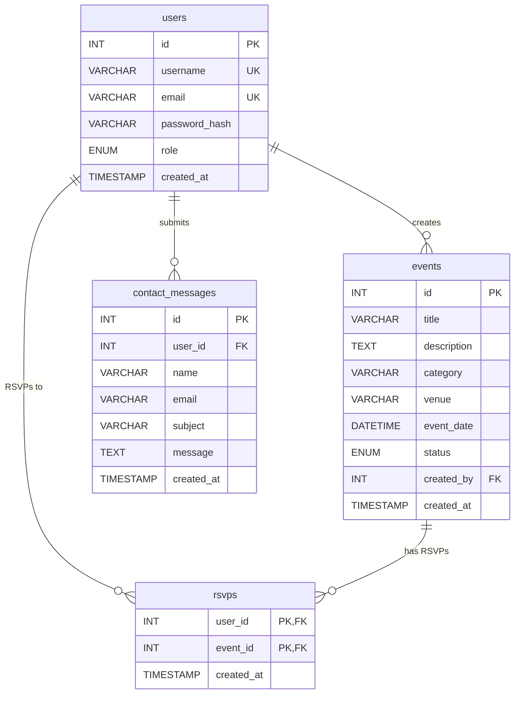
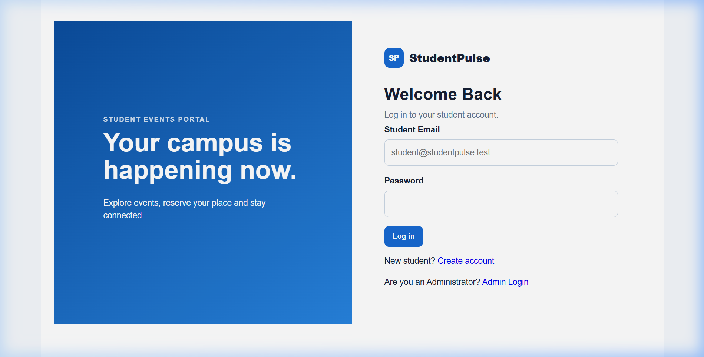
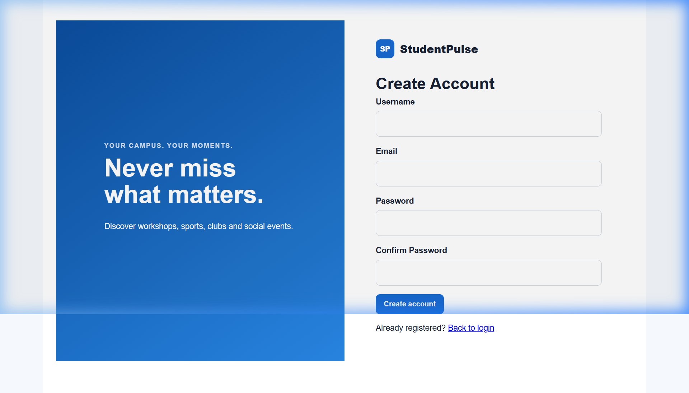
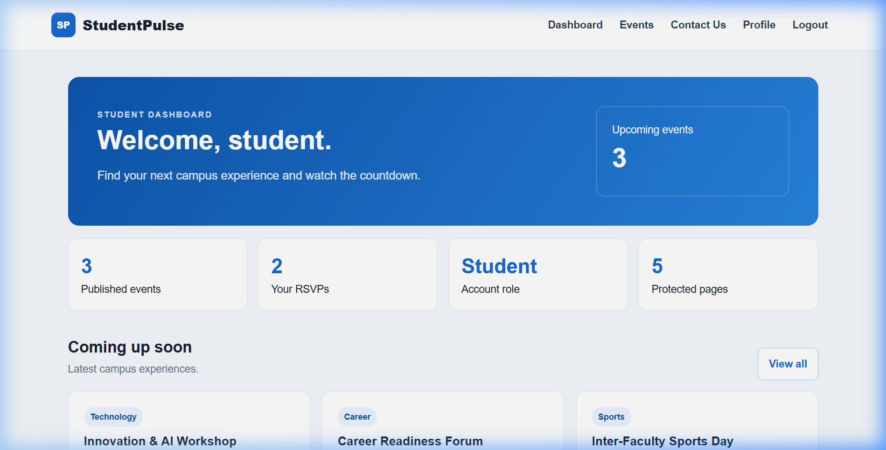
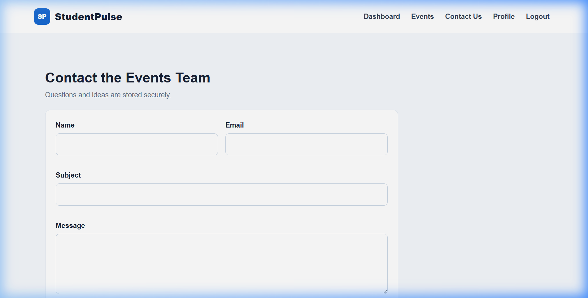
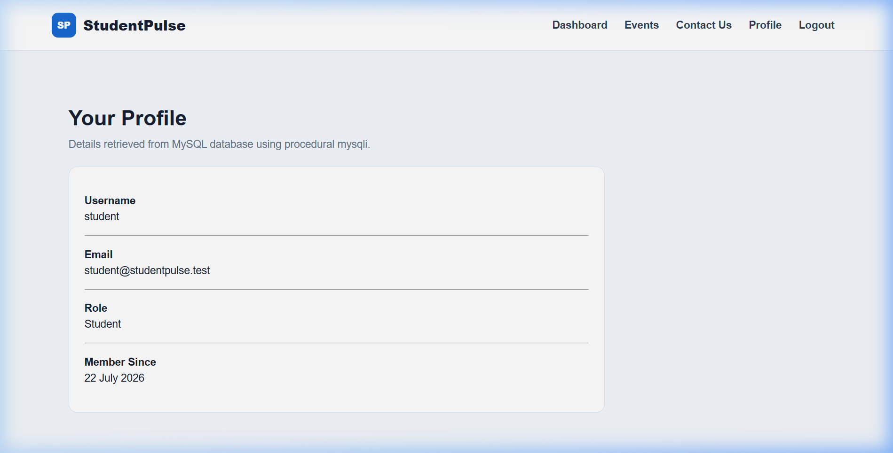
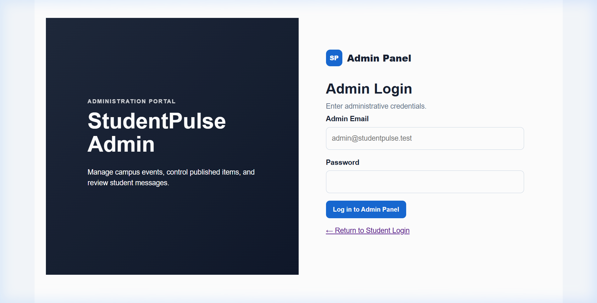
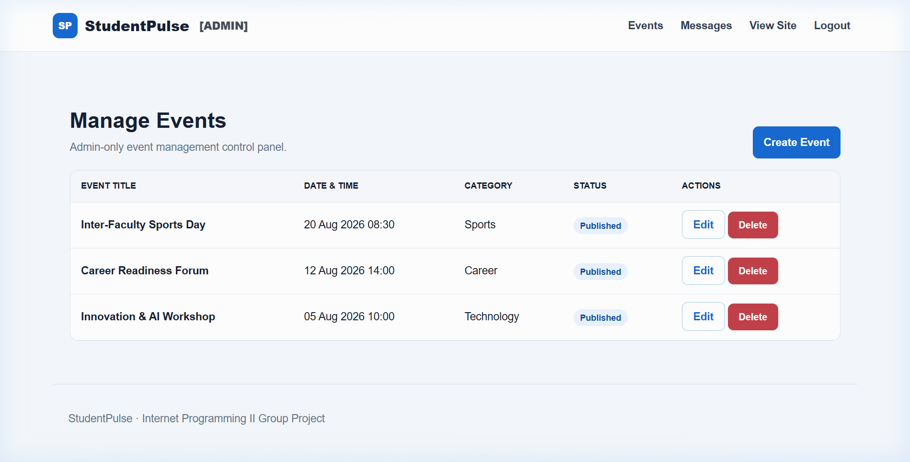
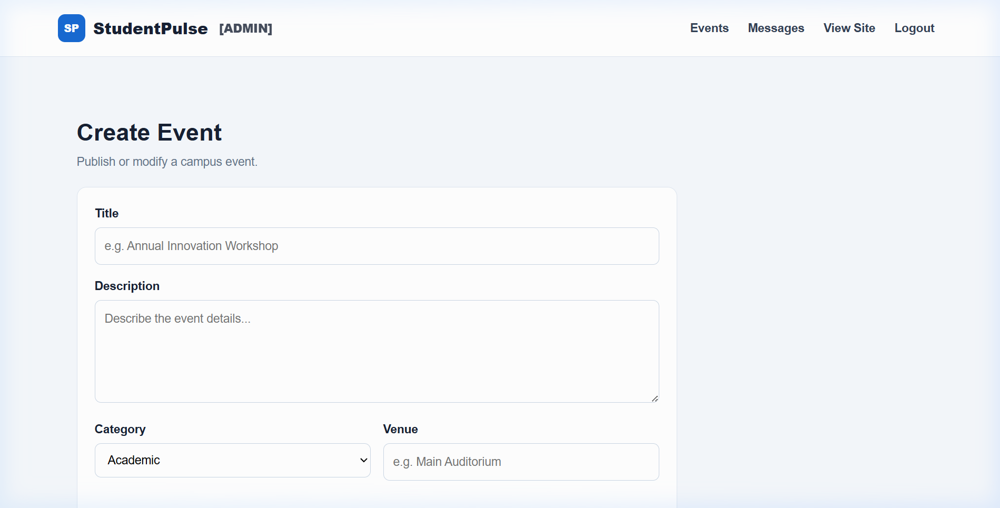
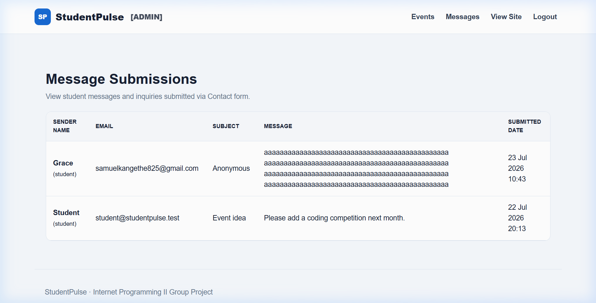

# StudentPulse – Project Documentation

**Course**: Internet Programming II  
**Assessment**: Continuous Assessment Test (CAAT)  
**Date**: July 2026

---

## Table of Contents

1. [Project Overview](#1-project-overview)
2. [Objectives](#2-objectives)
3. [Technology Stack](#3-technology-stack)
4. [System Architecture](#4-system-architecture)
5. [Database Design](#5-database-design)
6. [Installation & Setup Guide](#6-installation--setup-guide)
7. [User Interface Screenshots](#7-user-interface-screenshots)
8. [Feature Breakdown](#8-feature-breakdown)
9. [Security Implementation](#9-security-implementation)
10. [Code Structure & File Organization](#10-code-structure--file-organization)
11. [Testing & Validation](#11-testing--validation)
12. [Conclusion](#12-conclusion)
13. [Group Members](#13-group-members)

---

## 1. Project Overview

**StudentPulse** is a campus event management web application built to streamline the discovery, organization, and participation in university events. It provides two distinct portals:

- **Student Portal** – allows registered students to browse published campus events, RSVP to events they wish to attend, submit contact inquiries to the events team, view their profile, and track their participation through a personalized dashboard with live countdown timers.

- **Admin Portal** – provides authorized administrators with a dedicated control panel accessible at `/admin/` to create, edit, publish, draft, and delete campus events, as well as review student-submitted contact messages.

The application enforces **role-based access control**, ensuring students and administrators operate within separate authentication flows and session spaces.

---

## 2. Objectives

1. Build a functional campus event management system using PHP and MySQL.
2. Implement user authentication with separate login flows for students and administrators.
3. Apply CRUD (Create, Read, Update, Delete) operations for event management.
4. Use procedural MySQLi syntax for all database interactions to ensure code clarity and ease of explanation.
5. Enforce server-side validation and security measures (CSRF protection, password hashing, output escaping, session management).
6. Deliver a responsive, modern user interface using vanilla HTML5/CSS3.

---

## 3. Technology Stack

| Component        | Technology                                  |
|------------------|---------------------------------------------|
| **Server**       | Apache (via XAMPP)                           |
| **Backend**      | PHP 8.x (Procedural)                        |
| **Database**     | MySQL / MariaDB (via XAMPP)                  |
| **DB Access**    | Procedural MySQLi (`mysqli_*` functions)     |
| **Frontend**     | HTML5, CSS3, Vanilla JavaScript              |
| **Hosting**      | localhost (XAMPP on Windows)                  |

### Why Procedural MySQLi?

The project deliberately uses procedural `mysqli_*` functions rather than PDO or OOP-style database access. This decision was made because:

- `mysqli_connect()`, `mysqli_query()`, `mysqli_fetch_assoc()`, and `mysqli_real_escape_string()` are straightforward, readable, and easy to explain during presentations.
- Each database operation is clearly visible in the code without requiring knowledge of object-oriented patterns.
- The syntax directly maps to fundamental SQL concepts taught in the course.

---

## 4. System Architecture

The application follows a simple MVC-inspired structure without a formal framework:

```
┌──────────────────────────────────────────────┐
│                   Browser                     │
│         (Chrome / Firefox / Edge)             │
└────────────────┬─────────────────────────────┘
                 │ HTTP Request
                 ▼
┌──────────────────────────────────────────────┐
│            Apache Web Server                  │
│              (XAMPP)                           │
└────────────────┬─────────────────────────────┘
                 │ Routes to PHP file
                 ▼
┌──────────────────────────────────────────────┐
│           PHP Application Layer               │
│                                               │
│  ┌─────────────┐  ┌──────────────────────┐   │
│  │ includes/    │  │  Student Pages       │   │
│  │  core.php    │  │   login.php          │   │
│  │  header.php  │  │   register.php       │   │
│  │  footer.php  │  │   dashboard.php      │   │
│  │              │  │   events.php         │   │
│  │ config/      │  │   rsvp.php           │   │
│  │  database.php│  │   contact.php        │   │
│  └──────────────┘  │   profile.php        │   │
│                     │   submissions.php    │   │
│                     └──────────────────────┘   │
│  ┌──────────────────────────────────────────┐ │
│  │  Admin Pages (/admin/)                    │ │
│  │   login.php  │  events.php               │ │
│  │   logout.php │  event_form.php           │ │
│  │   index.php  │  delete.php               │ │
│  │              │  messages.php              │ │
│  └──────────────────────────────────────────┘ │
└────────────────┬─────────────────────────────┘
                 │ mysqli_query()
                 ▼
┌──────────────────────────────────────────────┐
│         MySQL Database Server                 │
│        Database: studentpulse                 │
│                                               │
│  Tables: users, events, rsvps,                │
│          contact_messages                     │
└──────────────────────────────────────────────┘
```

---

## 5. Database Design

### 5.1 Entity-Relationship Diagram



### 5.2 Table Descriptions

| Table               | Purpose                                                    |
|---------------------|------------------------------------------------------------|
| `users`             | Stores student and admin accounts with hashed passwords    |
| `events`            | Campus events with title, description, venue, date, status |
| `rsvps`             | Many-to-many join table linking students to events         |
| `contact_messages`  | Messages submitted by students through the Contact form    |

### 5.3 Key Relationships

- **users → events**: One admin can create many events (`created_by` foreign key).
- **users ↔ events (via rsvps)**: Many-to-many relationship. Students RSVP to events.
- **users → contact_messages**: One user can submit many contact messages.

---

## 6. Installation & Setup Guide

### Prerequisites
- XAMPP Control Panel (Apache + MySQL)

### Steps

1. **Extract** the `StudentPulse` folder into:
   ```
   C:\xampp\htdocs\StudentPulse
   ```

2. **Start XAMPP** – Open XAMPP Control Panel, click **Start** for both **Apache** and **MySQL**.

3. **Import Database** – Open http://localhost/phpmyadmin/, click the **Import** tab, choose the `database.sql` file from the project root, and click **Import/Go**.

4. **Access the Application**:
   - Student Portal: http://localhost/StudentPulse/login.php
   - Admin Portal: http://localhost/StudentPulse/admin/login.php

### Default Credentials

| Role    | Email                        | Password   |
|---------|------------------------------|------------|
| Admin   | admin@studentpulse.test      | password   |
| Student | student@studentpulse.test    | password   |

> Students can also self-register at http://localhost/StudentPulse/register.php

---

## 7. User Interface Screenshots

### 7.1 Student Portal

#### Student Login Page (`login.php`)
The student login page presents a split-screen layout with a branded art panel on the left and login form on the right. Students enter their email and password to authenticate. A link to admin login is provided for administrators.



---

#### Student Registration Page (`register.php`)
New students can create accounts by providing a username, email, and password (with confirmation). Server-side validation ensures unique usernames/emails and enforces minimum password length.



---

#### Student Dashboard (`dashboard.php`)
After login, students see a personalized dashboard showing their username, statistics (published events count, RSVP count, account role), and the 3 nearest upcoming events with live countdown timers.



---

#### Events Hub (`events.php`)
Students browse all upcoming published events. Each event card displays the category, title, description, venue, date, attendee count, a countdown timer, and an RSVP/Cancel button.


---

#### Contact Page (`contact.php`)
Students can submit inquiries or event ideas to the events team. The form validates name, email, subject, and message length on the server side before inserting into the database.



---

#### Profile Page (`profile.php`)
Displays the logged-in student's profile information retrieved from the MySQL database: username, email, role, and registration date.



---

### 7.2 Admin Portal

#### Admin Login Page (`admin/login.php`)
A dedicated login page for administrators, visually distinct from the student login with a darker theme. Only users with `role = 'admin'` in the database can authenticate here.



---

#### Admin – Manage Events (`admin/events.php`)
The admin events dashboard displays all events (including drafts) in a table format with columns for title, date, category, status, and action buttons (Edit / Delete). A "Create Event" button leads to the event creation form.



---

#### Admin – Create/Edit Event Form (`admin/event_form.php`)
Administrators use this form to create new events or edit existing ones. Fields include title, description, category (dropdown), venue, date/time (datetime-local input), and status (Published/Draft). Comprehensive server-side validation provides specific error messages for each field.



---

#### Admin – Message Submissions (`admin/messages.php`)
Administrators can review all student-submitted contact messages in a tabular format showing sender name, email, subject, message body, and submission date.



---

## 8. Feature Breakdown

### 8.1 Student Features

| Feature              | Page               | Description                                               |
|----------------------|--------------------|-----------------------------------------------------------|
| Student Login        | `login.php`        | Email/password authentication for students only           |
| Registration         | `register.php`     | Self-service account creation with validation             |
| Dashboard            | `dashboard.php`    | Personalized statistics and upcoming event previews       |
| Browse Events        | `events.php`       | View all published upcoming events with attendee counts   |
| RSVP / Cancel RSVP   | `rsvp.php`         | Join or withdraw from events via POST form                |
| Contact Form         | `contact.php`      | Submit messages/inquiries to the events team              |
| View Profile         | `profile.php`      | Display personal account information from database        |
| My Messages          | `submissions.php`  | View history of submitted contact messages                |

### 8.2 Admin Features

| Feature              | Page                   | Description                                           |
|----------------------|------------------------|-------------------------------------------------------|
| Admin Login          | `admin/login.php`      | Separate authentication for admin role only            |
| Manage Events        | `admin/events.php`     | View all events (published + drafts) in table          |
| Create Event         | `admin/event_form.php` | Form to create new campus events                      |
| Edit Event           | `admin/event_form.php` | Pre-populated form to modify existing events           |
| Delete Event         | `admin/delete.php`     | Remove events with confirmation prompt                 |
| View Messages        | `admin/messages.php`   | Review all student contact submissions                 |

---

## 9. Security Implementation

| Security Measure          | Implementation Detail                                                  |
|---------------------------|------------------------------------------------------------------------|
| **Password Hashing**      | All passwords stored using `password_hash()` with `PASSWORD_DEFAULT` (bcrypt). Verified at login with `password_verify()`. |
| **CSRF Protection**       | Every form includes a hidden CSRF token generated by `bin2hex(random_bytes(32))`. Validated on POST using `hash_equals()`. |
| **Output Escaping**       | All user-generated output passed through `htmlspecialchars()` via the `e()` helper to prevent XSS attacks. |
| **Input Sanitization**    | User inputs sanitized via `trim()`, `filter_var()`, and `mysqli_real_escape_string()` before database operations. |
| **Session Security**      | Sessions regenerated on login (`session_regenerate_id(true)`) to prevent session fixation. Full session destruction on logout. |
| **Role-Based Access**     | Separate session keys (`student_id` / `admin_id`) and authentication guards (`auth()` / `admin()`) enforce access control. |
| **Separate Login Flows**  | Students and admins authenticate through different pages with different session namespaces. |
| **Server-Side Validation**| All form data validated on the server regardless of HTML5 `required` attributes to prevent client-side bypass. |

---

## 10. Code Structure & File Organization

```
StudentPulse/
│
├── config/
│   └── database.php          # MySQL connection using procedural mysqli
│
├── includes/
│   ├── core.php              # Session management, helpers (auth, CSRF, flash)
│   ├── header.php            # Shared HTML head, navbar (student/admin modes)
│   └── footer.php            # Shared HTML footer + JS include
│
├── admin/                    # ── ADMIN PORTAL ──
│   ├── index.php             # Admin entry point (redirect to login/events)
│   ├── login.php             # Admin authentication page
│   ├── logout.php            # Admin session termination
│   ├── events.php            # Event management table (list all events)
│   ├── event_form.php        # Create / Edit event form with validation
│   ├── delete.php            # Delete event handler (POST only)
│   └── messages.php          # View student contact message submissions
│
├── assets/
│   ├── style.css             # Application stylesheet
│   └── app.js                # Client-side JavaScript (countdown timers)
│
├── documentation/
│   └── screenshots/          # UI screenshots for CAAT documentation
│
├── index.php                 # Entry point: redirects by session role
├── login.php                 # Student login page
├── register.php              # Student registration page
├── logout.php                # Student logout handler
├── dashboard.php             # Student dashboard with stats & events
├── events.php                # Student events listing with RSVP buttons
├── rsvp.php                  # RSVP join/cancel handler (POST only)
├── contact.php               # Student contact form
├── profile.php               # Student profile display
├── submissions.php           # Student's sent messages history
├── database.sql              # Full database schema + seed data
└── README.md                 # Setup instructions & credentials
```

### Key Design Decisions

1. **Shared Includes**: `core.php`, `header.php`, and `footer.php` are included by every page to avoid code duplication for session management, navigation, and HTML structure.

2. **Admin Separation**: All admin functionality lives under the `/admin/` directory with its own login flow, session keys, and navigation. The `admin()` guard function redirects unauthenticated users to `admin/login.php`.

3. **No Framework Dependency**: The project runs on vanilla PHP without Composer, frameworks, or third-party libraries, making it easy to deploy on any XAMPP installation.

---

## 11. Testing & Validation

### 11.1 PHP Syntax Validation
All 21 PHP files were validated using PHP's built-in linter (`php -l`). Every file passed with **zero syntax errors**.

### 11.2 Functional Testing

| Test Case                              | Expected Result                          | Status |
|----------------------------------------|------------------------------------------|--------|
| Student login with valid credentials   | Redirect to dashboard                   | ✅ Pass |
| Student login with invalid password    | Error message displayed                  | ✅ Pass |
| Admin login on student login page      | Rejected with redirect hint              | ✅ Pass |
| Admin login at `/admin/login.php`      | Redirect to admin events panel           | ✅ Pass |
| Student registration                   | Account created, redirect to login       | ✅ Pass |
| Duplicate email registration           | Error: "already exists"                  | ✅ Pass |
| RSVP to event                          | RSVP saved, button changes to "Cancel"   | ✅ Pass |
| Cancel RSVP                            | RSVP removed, button reverts to "RSVP"  | ✅ Pass |
| Admin create event (all fields valid)  | Event saved, redirect to event list      | ✅ Pass |
| Admin create event (empty title)       | Specific error: "Title is required"      | ✅ Pass |
| Admin create event (empty venue)       | Specific error: "Venue is required"      | ✅ Pass |
| Admin edit existing event              | Pre-populated form, updated on save      | ✅ Pass |
| Admin delete event                     | Confirmation prompt, event removed       | ✅ Pass |
| Contact form with valid data           | Message saved with flash notification    | ✅ Pass |
| Contact form with short message        | Error: "10–2,000 characters"            | ✅ Pass |
| CSRF token mismatch                    | 403 Forbidden response                   | ✅ Pass |
| Access dashboard without login         | Redirect to login page                   | ✅ Pass |
| Access admin pages without admin login | Redirect to admin login                  | ✅ Pass |
| Student logout                         | Session destroyed, redirect to login     | ✅ Pass |

---

## 12. Conclusion

StudentPulse successfully demonstrates core Internet Programming II concepts:

- **Server-side scripting** with PHP for dynamic page generation and form processing.
- **Database integration** with MySQL using procedural MySQLi for CRUD operations.
- **User authentication** with role-based access control separating student and admin functionalities.
- **Security best practices** including password hashing, CSRF protection, input validation, and output escaping.
- **Responsive web design** with a modern interface using vanilla HTML5, CSS3, and JavaScript.

The application provides a practical, real-world example of a campus event management system that could be extended with additional features such as event search/filtering, email notifications, image uploads, and calendar integration.

---

## 13. Group Members

| # | Full Name | Registration Number | Contribution |
|---|-----------|---------------------|--------------|
| 1 | Samuel Kangethe | __________________ | Project Lead / Full Stack Development |
| 2 | __________________ | __________________ | __________________ |
| 3 | __________________ | __________________ | __________________ |
| 4 | __________________ | __________________ | __________________ |
| 5 | __________________ | __________________ | __________________ |
